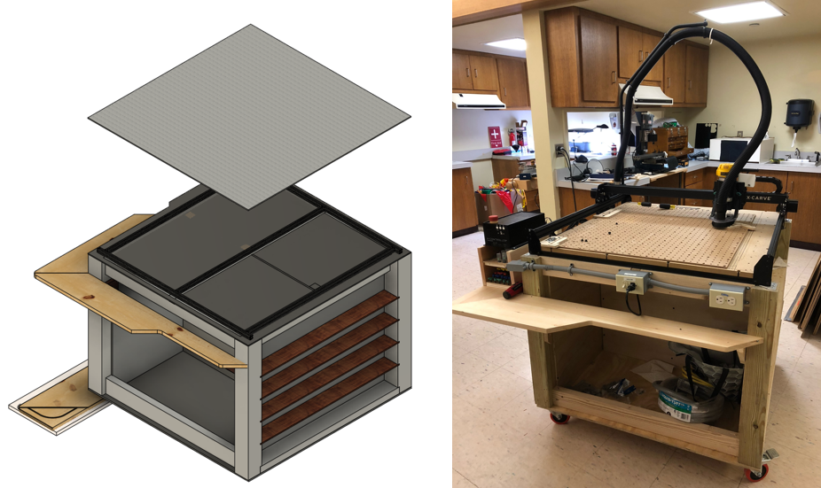
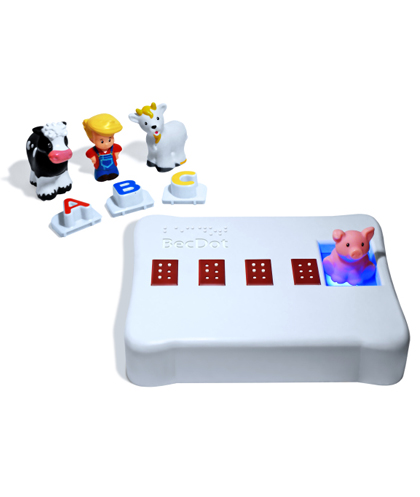
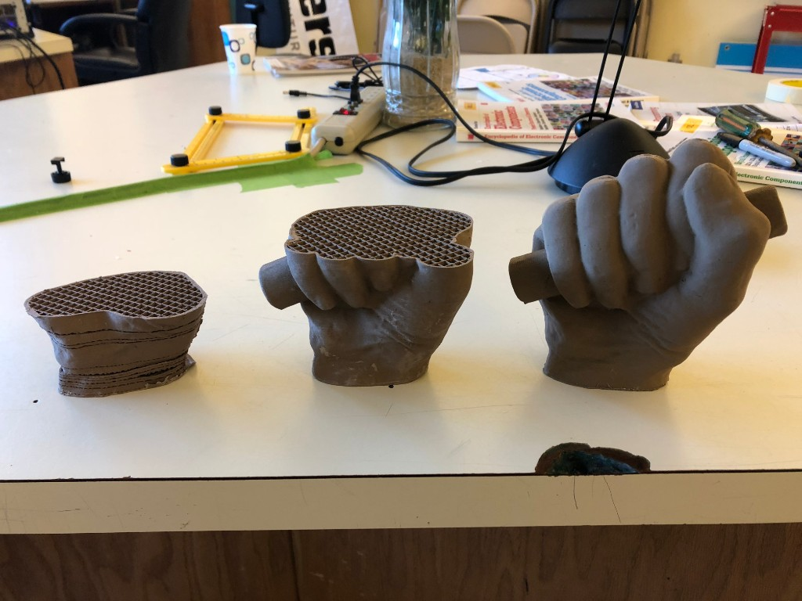

The cold weather really seemed to increase productivity at the MakerSpace. This month Rob designed and built a new cart to house the X-carve and its related equipment. The new cart freed up a table in MakerSpace and included soundproofing for the vacuum. Its a great addition to the space!

Jesse did a respin on his LegController design and we were able to reflow solder the new card in the toaster oven with no problems. The new design uses more surface mounted components and adds some capacitors to reduce signal noise.

In November we hosted a special Meetup to learn about the great work being done at Adapt the World Labs to assist children with vision and hearing problems. We had a good turn out and learned a lot about their process and how Makers can better apply there skills tohelping solve real world issues

Jim also worked on his 3D print of Lincoln’s hand in a plastic doped with bronze powder. The hand design comes straight from the Smithsonian and is based on a 3D scan of the original plaster cast taken from before Lincoln’s inauguration. The hand print took a few tries as the metal doped plastic is not the easiest to use but the final print is incredible. We also learned just how big Lincoln really was

