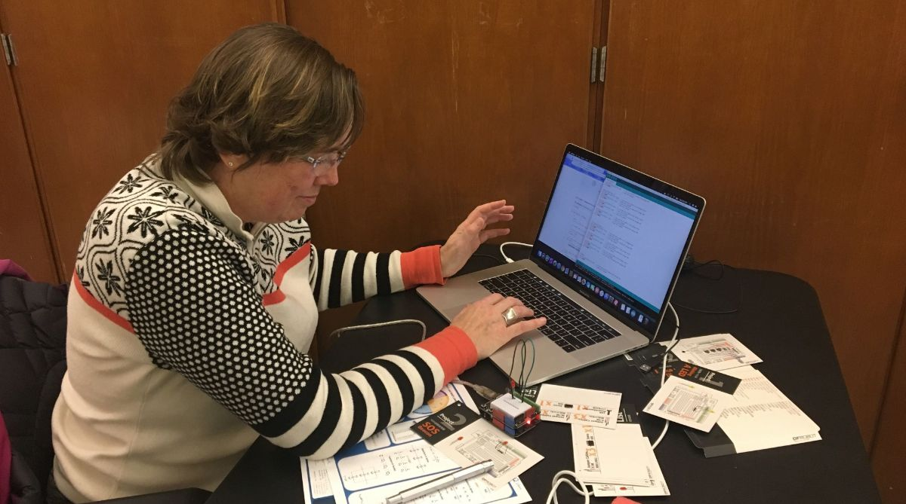
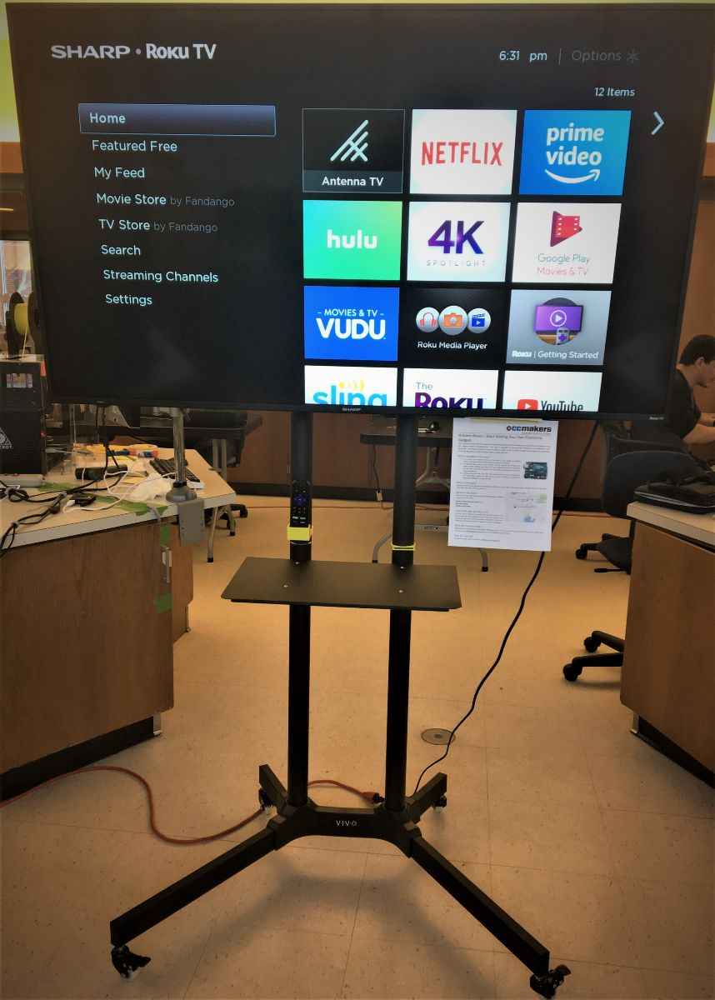

The makerspace has grown a lot since our last newsletter. We are happy to welcome 10 new members! We have also started a new round of classes and purchased some new equipment. Currently we are running the Arduino Basics class until the beginning of April. After that you should expect to see more classes posted as we have some others in development.

With our recent flurry of growth we have implemented a safety sign-off system for tool use. Every member must now receive basic safety training on each tool before they use it. As a side benefit of the training we have seen the tools getting a lot more use as people feel more comfortable with them. The 3D printer has been busy extruding non-stop during every project time.

We are very excited to have added several new computer workstations to the makerspace and a new TV for presenting. Any of the computers in the space can now screen share to the TV over WiFi. This enhances our classes by letting us show code excerpts, diagrams, and software tutorials. Another addition is a dehydrator for drying 3D printer filament. 3D printing with dry filament yields greater fine details in the print. After testing, we are estimating that a spool of 1kg of plastic stored indoors has about 2 grams of water in it before dehydration.

Thanks to the efforts of a few gifted makers our website has received a complete over-haul. The new site is better organized, showcasing the makerspace, events, classes, and information on how to join. Please take the opportunity to check it out: http://capecodmakers.org