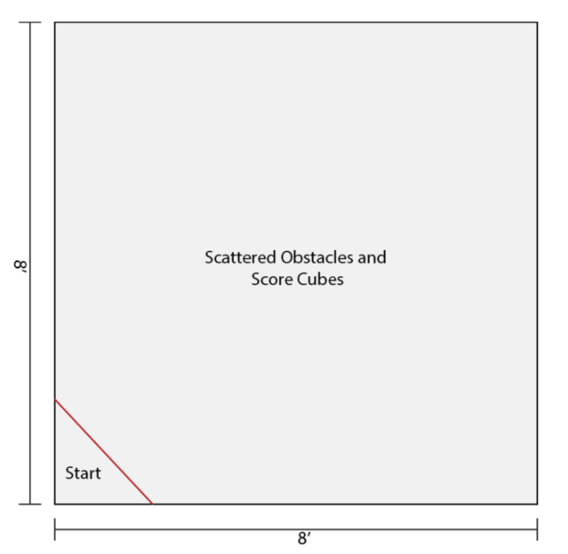

## Overview

Cape Cod Makers will be hosting its annual Robotics Competition at the 2019 Cape Cod Mini Maker Faire. This competition is designed to be accessible to people new to robotics, yet open-ended enough to allow experienced robotics developers a chance to show off their capabilities. Anyone is invited to participate with competitors broken into two leagues: Open League and Student League. Any team may register for Open League while the Student League is reserved for teams composed of students grades K-12. Teams may be of any size and participants can be on more than one team, however a robot can only be used by one team. The competition format is a time-limited treasure hunt. Each team will have 5 minutes to navigate an obstacle course, collecting and returning as many score cubes to the starting zone as possible. The team that collects the most score cubes during its 5 minutes will be announced the winner for its league.

## Registration

Teams are required to pre-register for the competition. Registration is free but is required for event planning purposes.

Registration can be completed online at: https://goo.gl/forms/j3qRgX4g5xAcCKjy2

An example score cube can be picked up at the LaunchPad MakerSpace during its open hours. Information on the LaunchPad MakerSpace, including its open hours, can be found at: https://capecodmakers.org/contact

## Competition Rules

To ensure a fun, safe, and fair competition, the following rules must be followed by all teams:

1. Robots must fit completely inside an enclosure 16” x 16” x 16” in size. This size limit is for the robot only and does not include any controller or other equipment used to operate the robot that is not directly attached to the robot. Wired controllers are not considered to be attached to the robot.

2. Robots must use purely electrical power sources (e.g. batteries). No combustion engines, hydraulics, or compressed gas cartridges may be used in the robot.

3. Robots may be user controlled via a wireless or wired controller, however no one is permitted inside the course during competition.

4. Robots must not actively attempt to destroy obstacles in the course. Accidental damage to the course is permissible at the discretion of the judges.

5. No projectiles will be permitted. This includes tethered projectiles (e.g. grappling hooks and net launchers). It is also not permissible to throw score cubes.

6. The flight ceiling for the course is 8’ above the course floor. Jumping and flying robots are permitted but must not break the flight ceiling.

7. Robots may carry any number of score cubes at the same time, but only score cubes located in the starting zone at the end of the time period are counted. Score cubes contained inside a robot are counted as long as the robot is located inside the starting zone at the end of the time period.

8. Off-the-shelf robots sold fully assembled and not substantially modified by the team are not permissible. Robots sold in kit form are permitted and encouraged.

9. No team will know the course layout prior to the competition day.

10. Teams may be of any size.

11. Competitors may be part of multiple teams.

12. A robot can only be used by one team.

13. Unsportsmanlike conduct will not be tolerated.

14. Teams are permitted one retry in the event of gross electrical, software, or mechanical failure. Before the retry, teams will be given a limited amount of time to effect repairs and alterations. The judges have discretion on what gross failure includes. Examples of gross failure include wires disconnecting, power failure, loss of remote connectivity, and wheel detachment.

Cape Cod Makers reserves the right to modify and add to these rules prior to the competition. Competitors are encouraged to send any questions regarding the rules to info@capecodmakers.org prior to the competition.

## Course Description

The basic course design will involve an 8’ x 8’ floor with obstacles and score cubes spread throughout. The competition area will be surrounded by a wall to ensure robots remain inside and provide a safe viewing area for spectators. One corner of the competition area will be marked as the starting zone. The specific design of the course and its obstacles will not be made public before the competition, but the following general information about the course should be used to drive teams’ robot designs.

**Basic Layout:** 8’x8’ indoor course completely surrounded by walls.

- No fluid terrain (e.g. no gravel, mud, water, or sand).

- Excluding specific obstacles, the course floor will have traction equal to or better than hardwood/tile flooring.

- Excluding specific obstacles, the course floor will be at a flat grade.

- Obstacles may include both fixed and dynamic (moving) elements.

- Some dynamic obstacles may react to the robot.

- All obstacles will be autonomously controlled to avoid any bias.

- Obstacles and score cube placement may differ between leagues but will be the same for all competitors inside a league.

On the competition day, prior to any competition, the exact course will be explained and demonstrated (approximately 10:00 am – 10:30 am).

## Design Recommendations

The following suggestions are offered to guide teams with their robot designs. This information is in no way complete and teams are encouraged to explore alternative designs.

- To simplify the task of controlling the robot it is suggested that teams rely on a human operator to remote control the robot. Autonomous designs are welcome but generally involve a great deal more expertise and development time.

- Wheeled and/or tracked robots will be effective for navigating the course and easier to implement than walking or flying designs.

- Some useful methods of collecting score cubes include gripper claws, front loaders, and bulldozers.

- Robots that can collect and carry multiple score cubes at the same time will likely have an advantage over designs that must return each cube before collecting the next.

You are encouraged to contact Cape Cod Makers with any questions during your robot design process. This includes help deciding what equipment and components to purchase for your robot and general information on design strategies. All inquiries should be sent to
[info@capecodmakers.org](mailto:info@capecodmakers.org).

[Click here](./cape-cod-mini-maker-faire-robotics-competition-rulebook.pdf) to download the PDF version of the rulebook.