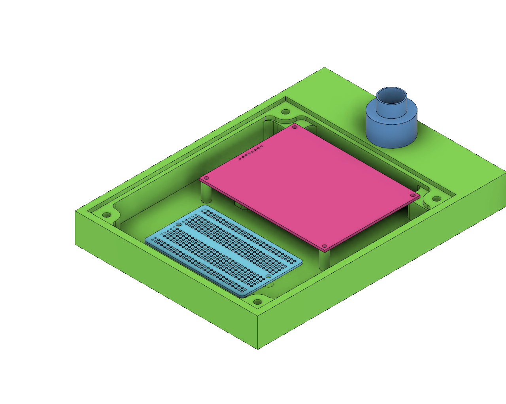

A quiet day today.  Marc S and I were there. Marc printed another jig for his peppercorn project. Sally F. came by with her project. We talked about using GIMP, and I showed her how to created text around a circle, from which we created a SVG file. It is as simple as exporting a path and naming the resulting file as a dot-svg. Programs are large and have a lot of capability, it is hard to be a master at it. Then, there is the skill retention half life when not using it.

We changed the filament to orange, and started a print for her.

The rest of the day, I worked on the Doorbell design. The MakerSpace is in the back of the building and the front door is not in earshot. So, Jesse has come come up with an electrical design and I need to fit it into a physical enclosure. I am currently thinking that the the electronics will be in a wooden box that we carve out with the X-Carve. There is a button to alert us that will be in a plastic insert, that will be in a hole in the wood box. Then, the solar panel is attached to the end of the box.

Mostly, this is because fof the capablities that we have inhouse. 

