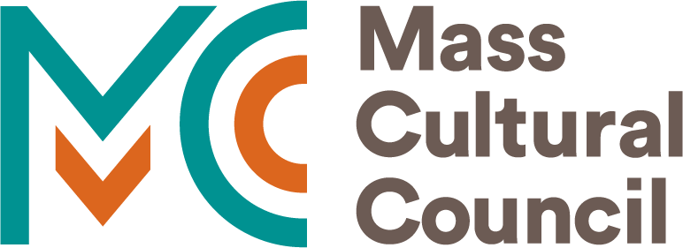
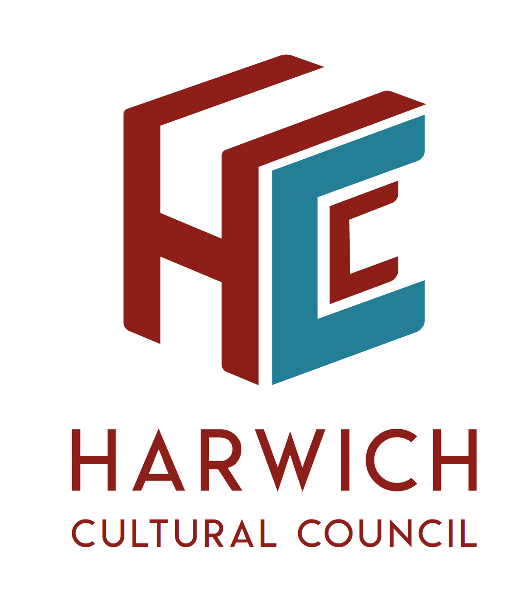

### ***Get Ready to Scan!***
 Cape Cod Makers has is happy to announce we have received a grant towards a Structure Sensor which is a 3D scanner. This will allow us to scan objects, people, perform a 3D room capture and experiment with 3D perception. These scans then can be stored, manipulated and improved. These scnas can be used digitally or to create real world objects with 3D printing and CNC machines.  We are looking forward to making this tool available to local community through our makerspace at the Harwich Cultural Center.  A big thank you to the Harwich Culture Council for supporting Cape Cod Makers. This program is supported in part by a grant from the Harwich Culture Council, a local agency which is supported by the Massachusetts Cultural Council, a state agency. 

[Massachusetts Cultural Council](www.massculturalcouncil.org.)

 

